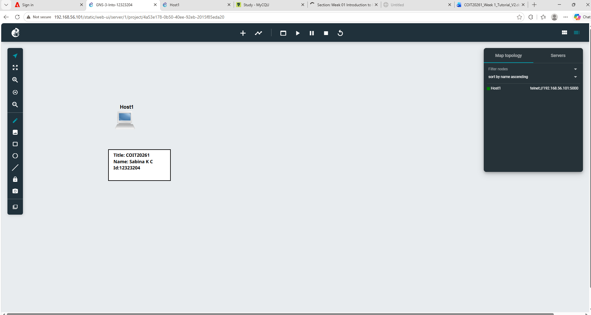
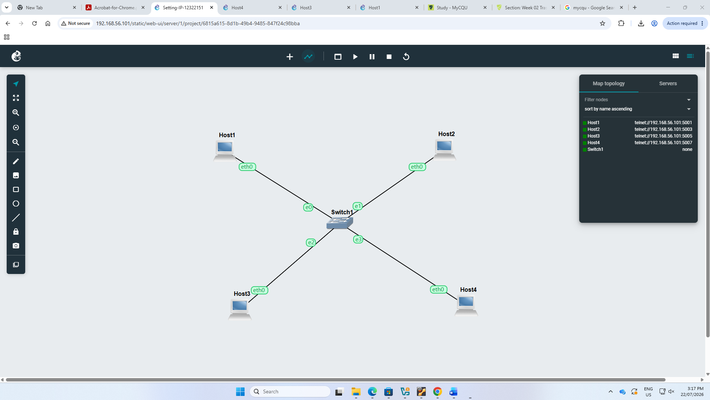
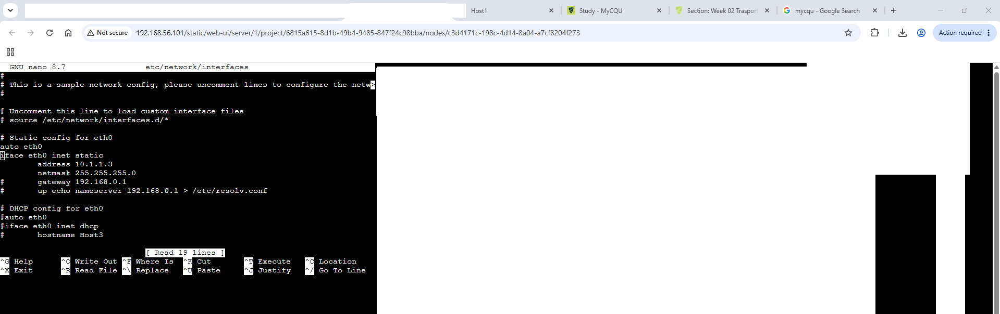
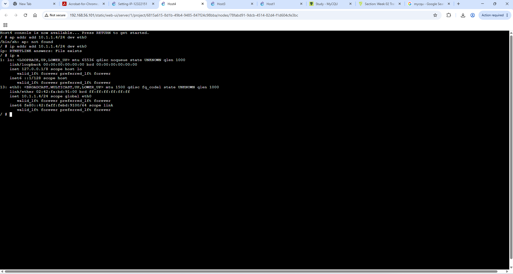

 Task 1: Introduction to GNS3 Basics 
 
I created my first GNS3 project using the required naming format like GNS3-Intro-12323204. This helped me become familiar with the GNS3 interface and understand how projects are organised before building a network.

I added a Linux host to my project and learned how network devices are placed inside a topology. This gave me a basic understanding of how hosts are represented in GNS3.

  
 

