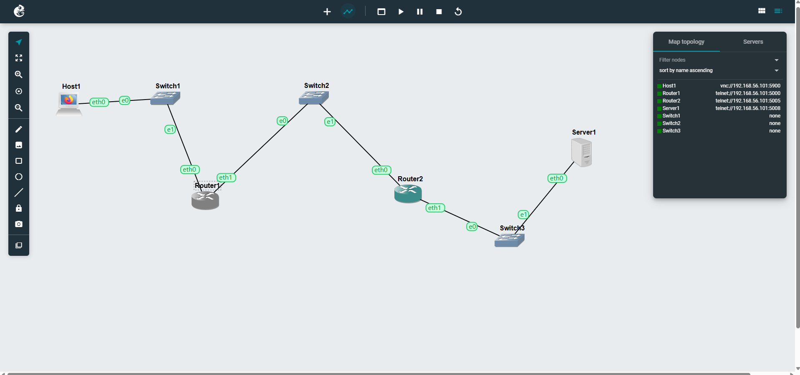
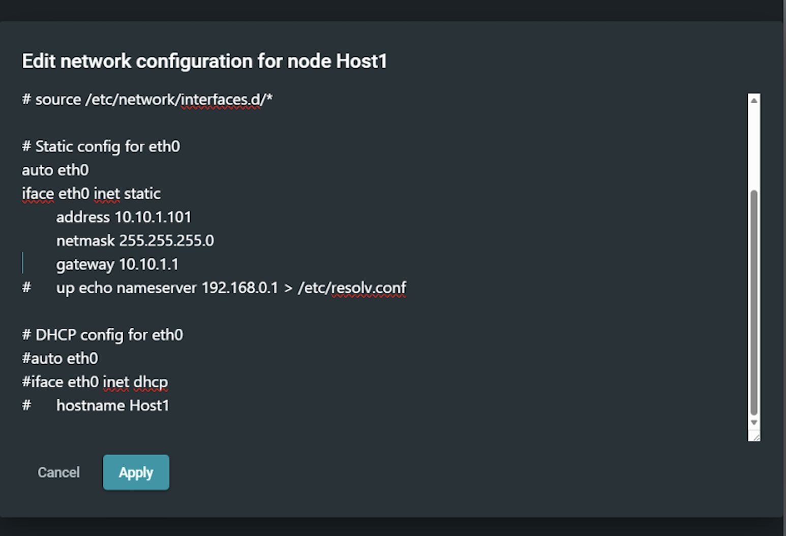
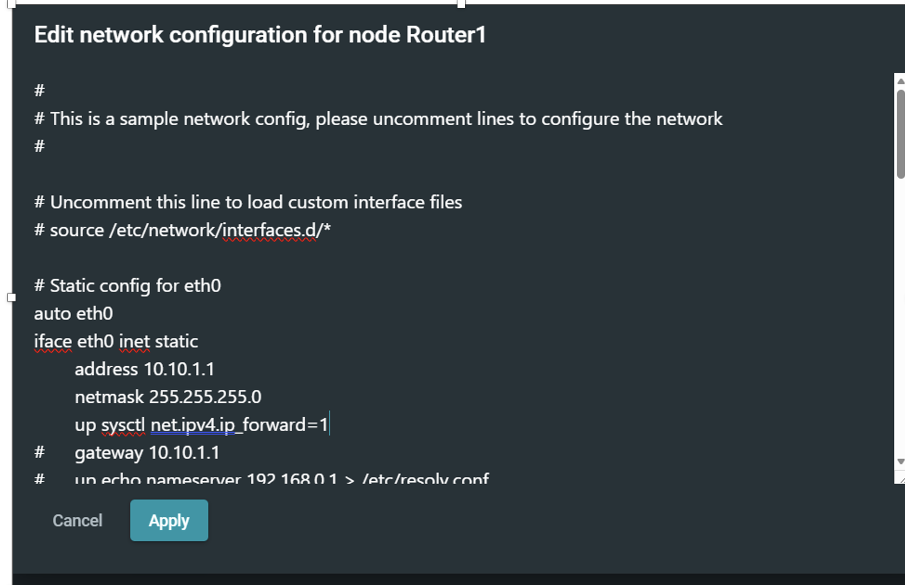
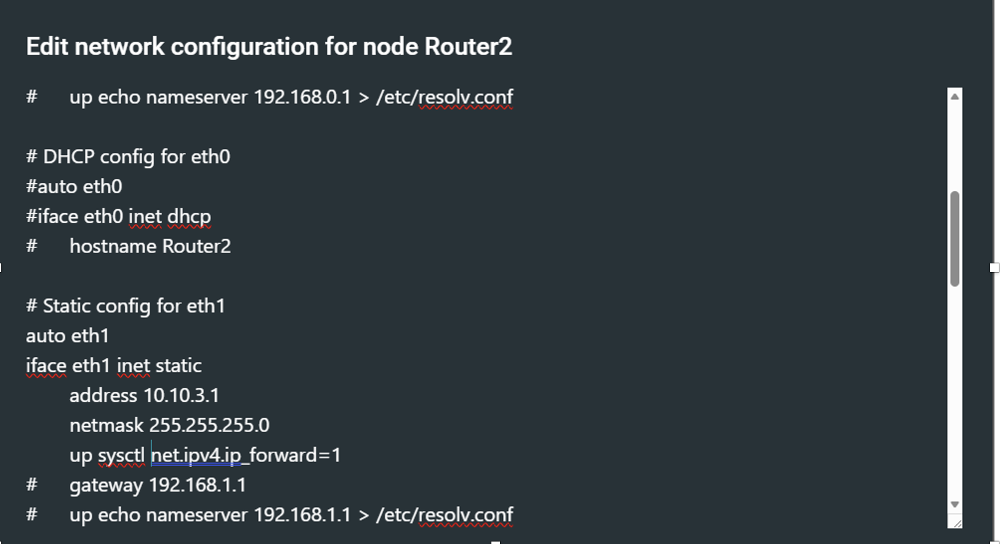
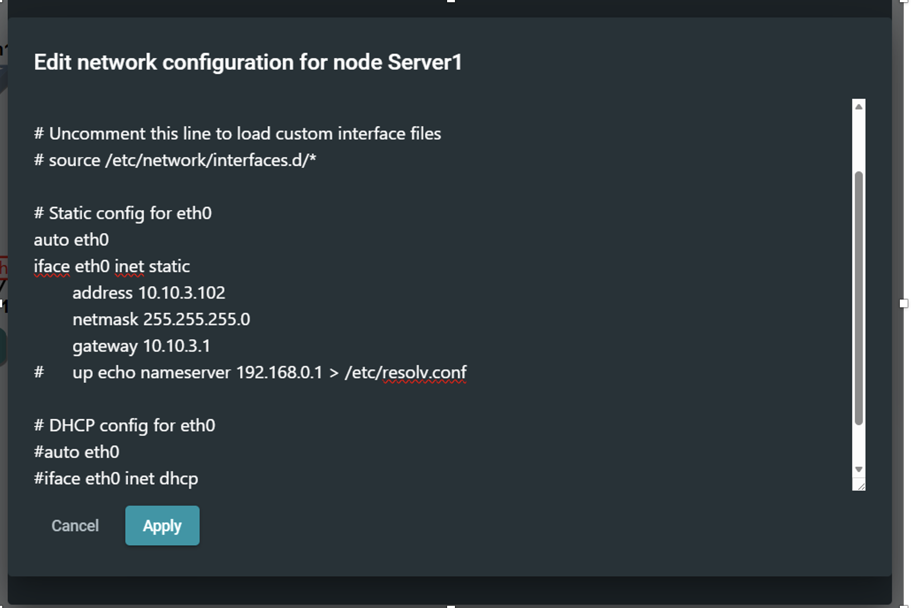
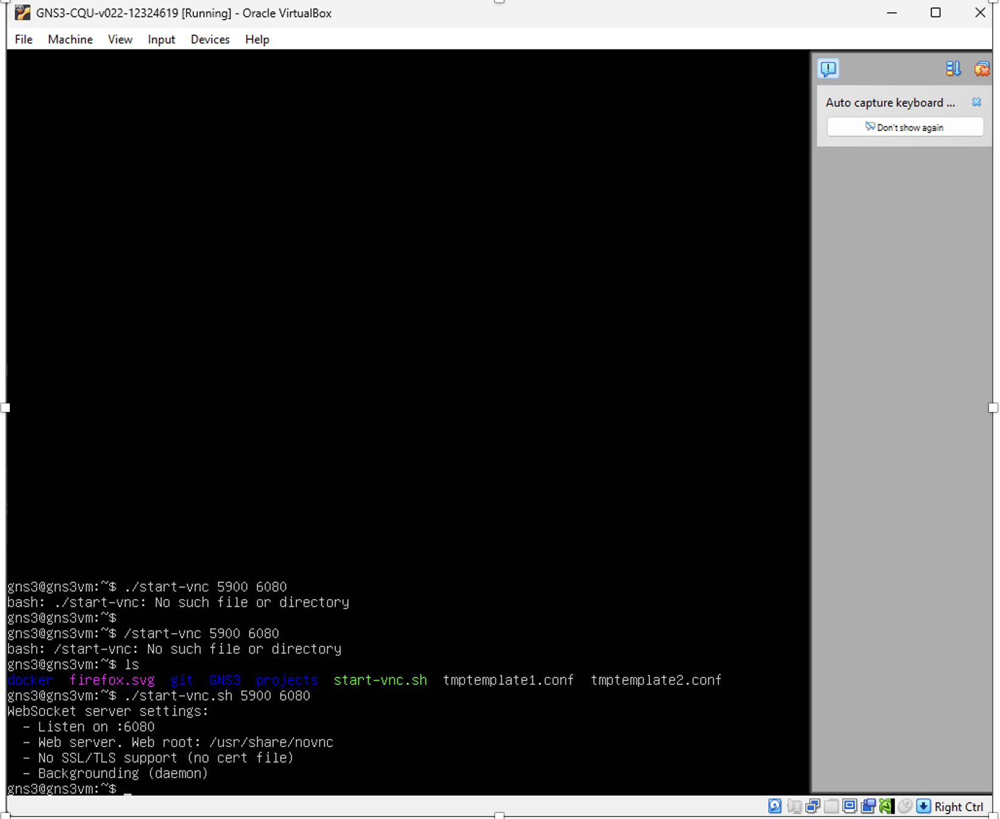
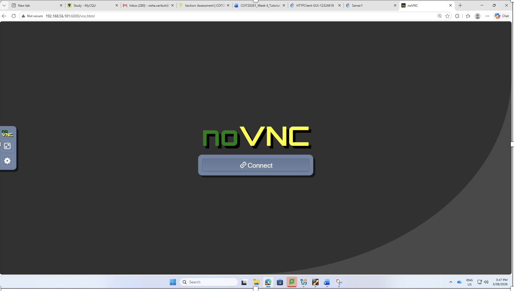
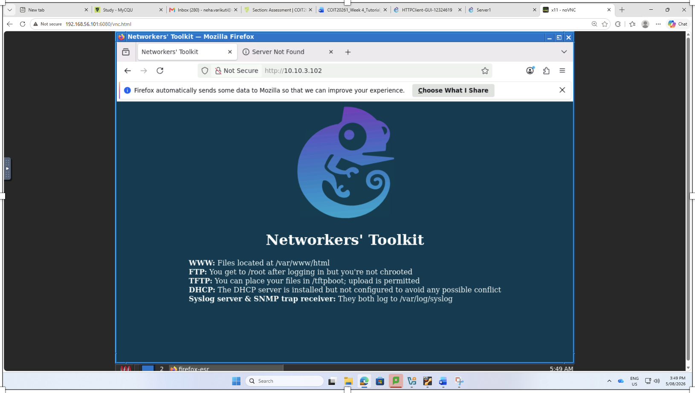
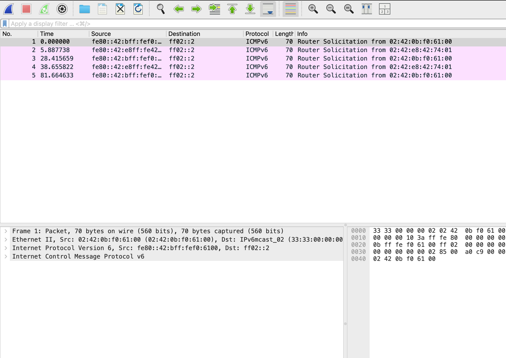
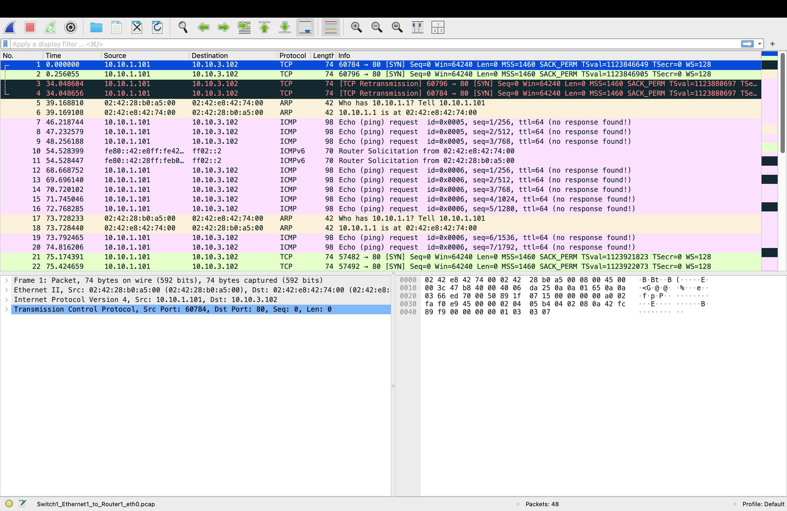

**Week 04 Tutorial**

**Task 1: HTTP Client with GUI** 

In this week’s tutorial, I worked on an HTTP client and network configuration using GNS3. I first created the network topology by connecting the host, routers, switches, and server. This helped me understand how different devices communicate across multiple networks.

This image shows the network topology I created in GNS3 using a host, switches, routers, and a server. This activity helped me understand how devices are connected and how data can travel from the client to the server through different networks.

In this step, I configured Host1 with the static IP address 10.10.1.101, subnet mask 255.255.255.0, and gateway 10.10.1.1. This helped me understand how a host needs the correct IP settings and default gateway to communicate outside its local network.

This screenshot shows the network configuration of Router1. I assigned the required IP address to the router interface and enabled IP forwarding. From this task, I learned that routers need IP forwarding enabled so they can pass packets between different networks.

Here, I configured Server1 with the static IP address 10.10.3.102, subnet mask 255.255.255.0, and gateway 10.10.3.1. This activity improved my understanding of how a server is configured so that clients from other networks can reach it.

In this step, I worked with the GNS3 virtual machine and attempted to start the VNC service. I initially received a “No such file or directory” error, which showed me the importance of checking the correct file name and location when running Linux commands. It also gave me some practical troubleshooting experience.

This screenshot shows the noVNC interface used to remotely access the virtual environment through the browser. This helped me understand how remote graphical access can be used to interact with devices running inside a network simulation.

In this step, I successfully accessed the server at 10.10.3.102 using Firefox and viewed the Networkers' Toolkit webpage. This confirmed that communication between the client and HTTP server was working and showed me how HTTP is used to access web resources across a network.

This image shows ICMPv6 Router Solicitation packets captured in Wireshark. By looking at the source, destination, protocol, and packet information, I gained a better understanding of how IPv6 devices communicate and discover routers on a network.

In the final step, I analysed network traffic in Wireshark and observed TCP, ARP, and ICMP packets. I could see TCP connection attempts to port 80, ARP messages used to identify devices on the local network, and ICMP ping requests. This activity helped me connect the networking concepts I learned in theory with actual packet-level communication.

This week's tutorial improved my practical understanding of network configuration and HTTP communication. I learned how to configure IP addresses and gateways, enable routing, access a web server, and analyse network traffic using Wireshark. The troubleshooting I experienced also helped me understand how configuration errors can affect communication between devices.

