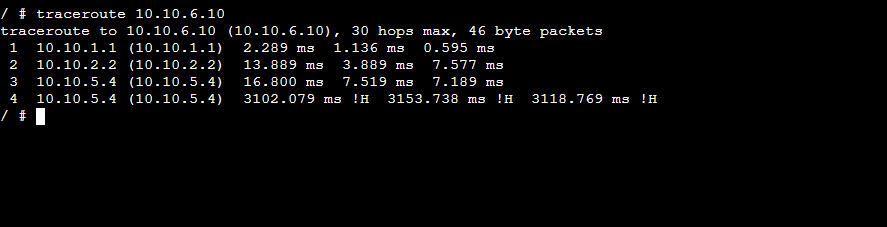
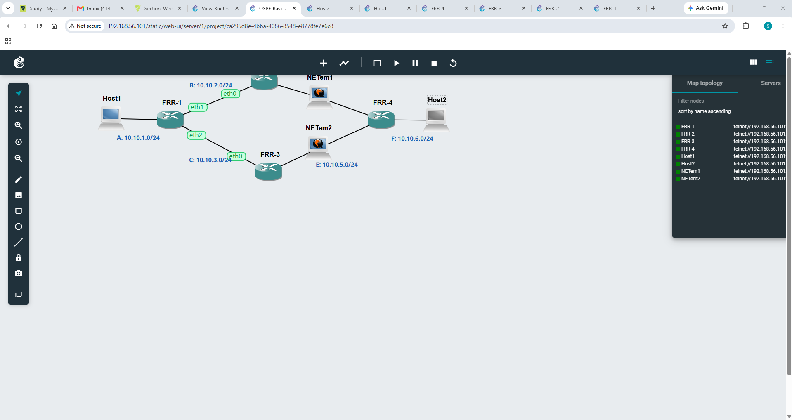
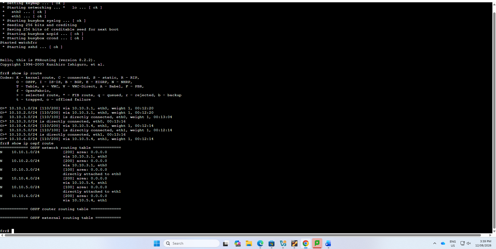
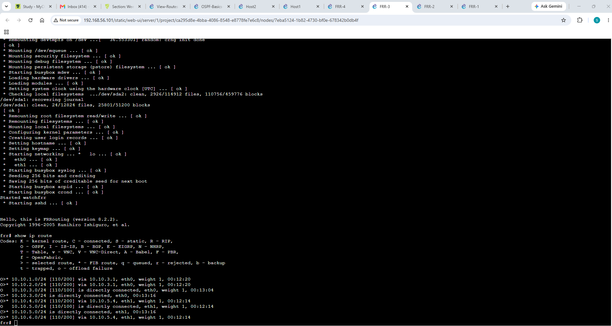
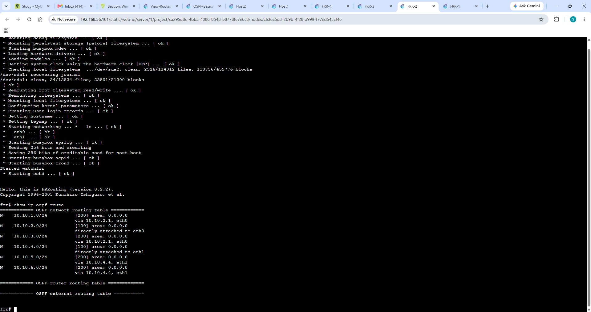
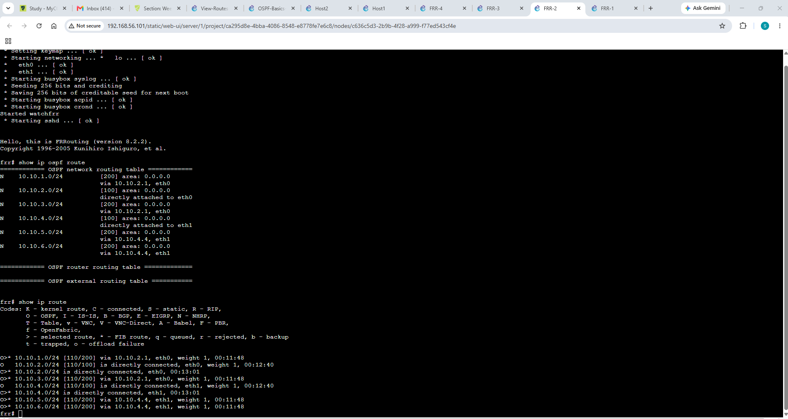
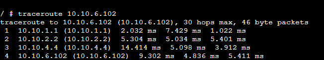
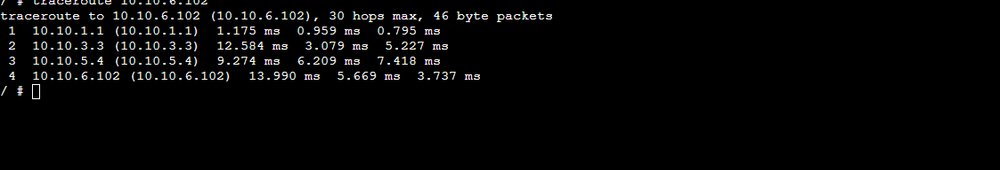

Week 05 Tutorial

This week, I learned how routing works between different networks. I configured IP addresses, checked routing tables, and tested connectivity using ping and traceroute. I also learned how OSPF dynamic routing allows routers to automatically discover routes and choose paths between networks. The practical activities helped me understand the difference between directly connected routes and dynamically learned routes.

**Task 1: View Routing Tables**

In this activity, I created a basic network topology containing Host1, Host2, Switch1, Router1 and Host3. Host1 and Host2 are connected through the switch, while the router connects them to another network containing Host3. This activity helped me understand how routers are used to connect devices that belong to different networks.

I configured Host1 with the static IP address 10.1.1.2 and subnet mask 255.255.255.0. I also configured 10.1.1.1 as the default gateway. This helped me understand that a host needs a correct IP address, subnet mask and gateway to communicate with devices outside its local network.

I configured Host2 with the static IP address 10.1.1.3 and subnet mask 255.255.255.0. The default gateway was set to 10.1.1.1. Because Host1 and Host2 are on the same 10.1.1.0/24 network, they can communicate locally through the switch.

In this step, I configured the network interface of Router1. The router interface was assigned 10.1.1.1/24, which acts as the gateway for the hosts on this network. This activity helped me understand the important role of a router interface when forwarding packets between different networks.

 I configured Host3 with the static IP address 10.1.2.2, subnet mask 255.255.255.0, and default gateway 10.1.2.1. Host3 is located on a different network from Host1 and Host2. This showed me why a default gateway is required when communicating between different subnets.

**Task 2: Dynamic Routing with OSPF**

Screenshot of show ip ospf route, show ip ospf route, show ip route

Traceroute

